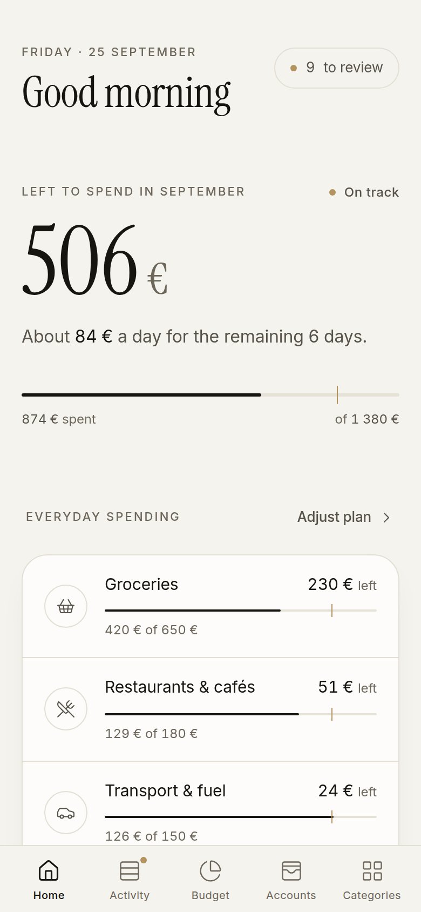
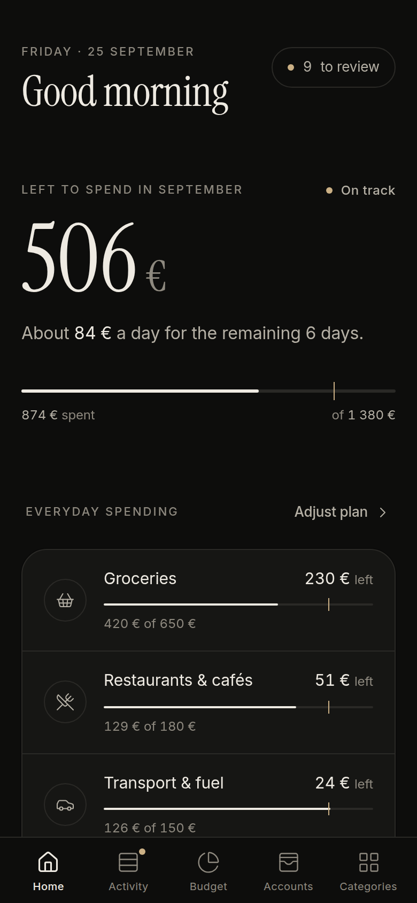
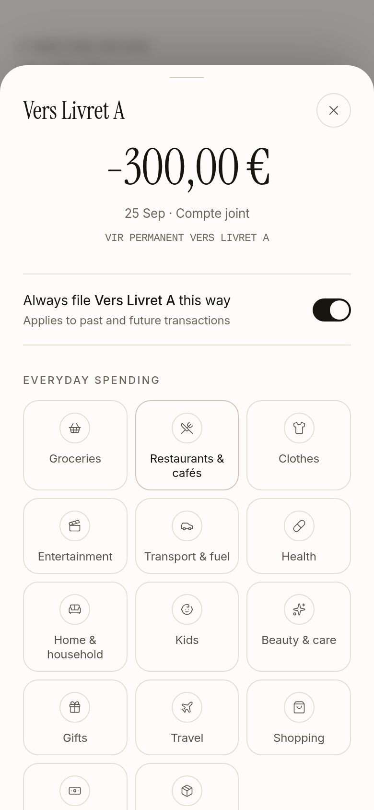

# Hearth — our household budget

A calm, phone-first budgeting app for a household that banks with **CCF**. Open it any day of the month and it tells you one thing first: **how much is left to spend**, and how much that is per day.

<p>
  
  
  
</p>

## What it does

| Need | How Hearth handles it |
|---|---|
| **Bring in CCF income & expenses** | Automatic read-only sync through open banking (PSD2, via [Enable Banking](https://enablebanking.com), which is free for your own accounts), **or** import the OFX/CSV file downloaded from CCF online banking. Re-importing overlapping periods is safe: duplicates are skipped. |
| **Fixed vs. flexible spending** | Every category is *Fixed bills* (mortgage, electricity, internet, insurance…), *Everyday spending* (groceries, restaurants, clothes, fun…), *Income*, or *Not spending* (transfers to savings, card settlements, which the budget ignores). About 300 common French merchants and billers (EDF, Free, Carrefour, Monoprix, SNCF, Uber Eats…) are recognised automatically. |
| **Plan at the start of the month** | On the Budget page, set one amount per category. **Copy last month** or **Use 3-month average** fills it in one tap, and each row shows "usually €X" as a one-tap suggestion. A strip shows income − bills − everyday = *left to plan*. |
| **Know what's left at any moment** | The home screen shows *left to spend*, the per-day amount for the rest of the month, and a bar for each category with a **pace marker** (where you'd be if you spent evenly). Categories turn amber when spending runs ahead of pace and red when they go over. Fixed bills show as a paid/due checklist. |

### Design choices, borrowed from the best apps
- **One number first** (like Copilot and Monarch): the hero card answers "can I buy this?" without any maths.
- **Fixed vs. flexible budgeting** (like Monarch's *Flex budgeting*): bills are planned once and then left alone. Attention goes to the part you control.
- **Give every euro a job** (like YNAB): the *left to plan* figure shows whether the plan fits your income.
- **Review queue** (like Copilot): new transactions get a dot until someone confirms them. One tap on a category saves it, and ticking **"Always use this for …"** creates a rule, re-files past transactions and handles future ones.
- **Uncategorised spending counts as everyday spending**, so "left to spend" can only be too cautious, never too optimistic.
- **Quiet, premium look.** Warm ivory paper and near-black ink, a serif (Instrument Serif) for headings and numbers, Inter for everything else, and thin line icons (Lucide). A single champagne accent marks what matters: the pace tick, items to review. Colour appears only when something needs attention: ochre when a category runs ahead of pace, terracotta when it goes over. Every text colour meets WCAG AA contrast in both light and dark mode.
- Phone-first: a bottom tab bar and bottom sheets for thumbs, and it installs to the home screen as a PWA. Amounts use French formatting (1 234,56 €).

## Quick start

```bash
npm install
npm run dev                      # http://localhost:3000
```

To try it with realistic sample data first:

```bash
DATABASE_PATH=./data/demo.db npm run seed:demo
DATABASE_PATH=./data/demo.db npm run dev
```

Your real data lives in `./data/hearth.db` (SQLite, a single file you can back up). Copy `.env.example` to `.env.local` for the settings below.

## Connect CCF

### Option A: automatic sync (recommended)
1. Create a free account at [enablebanking.com](https://enablebanking.com/cp/) and register an application. Choose the *Production* environment and set the redirect URL to `https://<your-app>/api/bank/callback`. Keep the downloaded `.pem` private key.
2. In the Enable Banking control panel, **link your CCF account(s)**. This activates free *restricted production* access, limited to the accounts you linked.
3. Add the credentials to `.env.local`:
   ```
   ENABLE_BANKING_APP_ID=…
   ENABLE_BANKING_KEY_PATH=./secrets/enablebanking.pem
   ```
4. In Hearth, go to **Accounts → Connect CCF automatically**, choose CCF and approve in the CCF app. The last 90 days are imported.
5. Use the **Sync now** button, or schedule a sync (for example every 6 hours):
   `curl -X POST -H "Authorization: Bearer $CRON_SECRET" https://<your-app>/api/sync`

Access is read-only. Under PSD2, consent lasts up to 180 days, and Hearth warns you two weeks before it expires. Pending card payments are shown and replaced when they book; any category you already chose carries over.

### Option B: statement files
In CCF online banking, export your operations as **OFX** (best, because it includes the balance) or **CSV**, then drop the file on **Accounts → Import a statement**. The importer finds the usual French column names (*Date opération, Libellé, Débit, Crédit, Montant*) and reads Windows-1252 files.

## Deploying

The app is one small Node server plus one SQLite file, so any host with a persistent disk works (a home NAS or Raspberry Pi, Fly.io, Railway…).

```bash
docker build -t hearth .
docker run -p 3000:3000 -v hearth-data:/data \
  -e APP_PASSWORD=… -e AUTH_SECRET=$(openssl rand -hex 32) \
  -e ENABLE_BANKING_APP_ID=… -e ENABLE_BANKING_PRIVATE_KEY="$(cat key.pem)" \
  -e PUBLIC_URL=https://budget.example.com hearth
```

**Always set `APP_PASSWORD` before exposing the app to the internet.** Both of you sign in once per device, and the session lasts 90 days.

## Development

```bash
npm test            # unit tests: parsers, categoriser, budget maths
npm run lint
npm run typecheck
npm run db:generate # after editing src/db/schema.ts
```

| Path | What's there |
|---|---|
| `src/lib/budget.ts` | Pure budget maths: left to spend, pace, bill status |
| `src/lib/categorize.ts` | Cleaning merchant names and categorising (built-in French hints plus your rules) |
| `src/lib/import/` | OFX and CSV parsers |
| `src/lib/bank/enablebanking.ts` | PSD2 client (JWT auth, accounts, balances, transactions) |
| `src/lib/ingest.ts`, `src/lib/sync.ts` | De-duplicating inserts, pending-transaction replacement |
| `src/app/(app)/` | Pages: Home, Activity, Budget, Accounts, Categories |
| `src/app/actions.ts` | Server actions (each checks the session) |

Stack: Next.js 16 (App Router, server actions), React 19, Tailwind CSS 4, SQLite via better-sqlite3 + Drizzle ORM. Amounts are stored as integer cents.

## Ideas for later
- Rolling unspent everyday money into next month
- Savings goals (holidays, Christmas)
- Splitting one transaction across several categories
- Push notification when a category passes 80%
